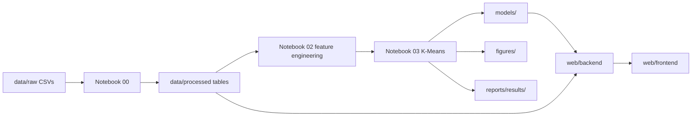

# Project Architecture

This document explains how the repository is organized and how data moves through the pipeline.

## Core flow

## Folder responsibilities

| Folder            | Role                                                                       |
| ----------------- | -------------------------------------------------------------------------- |
| `data/raw/`       | Original OULAD CSV files. These files should not be edited.                |
| `data/processed/` | Derived student-level tables and arrays used by notebooks and the web app. |
| `notebooks/`      | The analysis workflow, one notebook per stage or model family.             |
| `src/`            | Reusable functions shared by notebooks, tests, and backend code.           |
| `models/`         | Saved estimators and other serialised artifacts.                           |
| `figures/`        | Plots exported by the notebooks.                                           |
| `reports/`        | Paper draft, tables, slides, and supporting exports.                       |
| `web/`            | Backend API and frontend dashboard code.                                   |

## Notebook structure

The notebooks follow the same sequence used in the project work:

1. `00_data_engineering.ipynb` builds the master student table.
2. `01_eda.ipynb` inspects the data and identifies cleaning issues.
3. `02_feature_engineering.ipynb` creates the final behavioral feature set.
4. `03_kmeans_clustering.ipynb` trains and interprets the K-Means model.
5. `04_hierarchical_clustering.ipynb`, `05_dbscan_clustering.ipynb`, and `06_gmm_clustering.ipynb` provide alternative clustering baselines.
6. `07_model_comparison.ipynb` compares the clustering outputs.
7. `08_research_paper_dtw_pure_raw.ipynb` documents the DTW experiment on raw weekly click sequences.

## Shared code

The `src/` package is kept separate from notebooks so the same logic can be reused in tests and in the backend. The clustering package contains the model training and evaluation helpers, while the other top-level modules handle loading, preprocessing, feature engineering, and plotting.

## Web app integration

The dashboard reads from `data/processed/` and `models/`. The backend should not re-run notebooks; it should load saved artifacts and expose them through API endpoints.

## Practical rule

Notebook outputs are the source of truth for analysis. Shared modules in `src/` should contain only reusable code that has already been validated in the notebooks.
