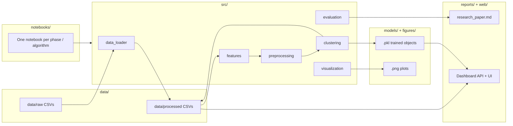

# Project Architecture

> How folders fit together, why `src/` and `models/` exist, and where each deliverable lives.

## High-level flow



---

## Why `src/` exists (and is not redundant with notebooks)

| | **Notebooks** | **`src/`** |
|---|---|---|
| **Purpose** | Exploration, narrative, plots, decisions | Reusable, testable Python functions |
| **Audience** | Team + jury (readable story) | Developers + web backend (imports) |
| **Runs in** | Jupyter only | Notebooks, tests, `web/backend`, CLI |
| **Changes** | Often during EDA | Stabilizes once logic is correct |

**Ownership:** See **`src/README.md`**. Each teammate implements **their** file after finishing their notebook. Files start as **spec + docstrings only** (`NotImplementedError`). M1 only edits `data_loader.py`.

**Rule of thumb:** Write code in your notebook first; copy into `src/` when it works. Do not edit another member’s `src/` file.

Example:

```python
# In notebooks/03_kmeans_clustering.ipynb
from src.clustering import fit_kmeans, find_optimal_k
from src.evaluation import silhouette_on_scaled

optimal = find_optimal_k(X_scaled)
model = fit_kmeans(X_scaled, n_clusters=chosen_k)  # saves to models/kmeans.pkl
```

The **website backend** will also import from `src/` and load artifacts from `models/` — without re-running notebooks.

---

## Why `models/` exists (separate from `data/processed/`)

| Folder | Contents | Format | Used for |
|--------|----------|--------|----------|
| **`data/processed/`** | Tables: one row per student | `.csv`, `.npy` | Human inspection, pandas, reports |
| **`models/`** | Fitted ML objects | `.pkl` (joblib) | Predict/assign clusters on new data, web API |

**Processed data** = *what happened* (features, cluster labels per student).  
**Models** = *how to reproduce it* (scaler, K-Means centroids, PCA, GMM).

Typical artifacts:

| File | Created by | Needed by |
|------|------------|-----------|
| `scaler.pkl` | M2 preprocessing | Inverse-transform centroids; web API input scaling |
| `pca_model.pkl` | M2 | 2D scatter plot; optional API viz |
| `kmeans.pkl` | Notebook 03 | Assign cluster to new student vector |
| `hierarchical.pkl` | Notebook 04 | Comparison / ARI |
| `dbscan.pkl` | Notebook 05 | Noise-point analysis |
| `gmm.pkl` | Notebook 06 | Soft cluster probabilities |

Both folders are **git-ignored** (large / regenerable). Only `.gitkeep` is tracked so the directories exist after clone.

---

## Notebook layout (one algorithm + interpretation each)

| Notebook | Owner | Algorithm / topic | Saves to |
|----------|-------|-------------------|----------|
| `00_data_engineering.ipynb` | M1 | Load, merge, `master_raw.csv` | `data/processed/` |
| `01_eda.ipynb` | M2 | 7 EDA plots | `figures/` (optional) |
| `02_feature_engineering.ipynb` | M2 | 20 features, scaling, PCA | `processed/`, `models/scaler.pkl` |
| `03_kmeans_clustering.ipynb` | M3 | K-Means + elbow + **cluster interpretation** | `models/kmeans.pkl`, `figures/` |
| `04_hierarchical_clustering.ipynb` | M3 | Ward HC + dendrogram + interpretation | `models/hierarchical.pkl` |
| `05_dbscan_clustering.ipynb` | M3 | DBSCAN + noise analysis + interpretation | `models/dbscan.pkl` |
| `06_gmm_clustering.ipynb` | M3 | GMM + soft labels + interpretation | `models/gmm.pkl` |
| `07_model_comparison.ipynb` | M3 | Metrics table, ARI across models | `reports/results/` |
| `08_interpretation_at_risk.ipynb` | M4 | Labels, risk score, 6 figures | `figures/`, `reports/results/` |
| `MAIN_NOTEBOOK.ipynb` | All | End-to-end demo (Restart & Run All) | — |

Each algorithm notebook ends with a **mini interpretation section**: cluster centroids (inverse-scaled), `final_result` crosstab, 2–3 sentence profile per cluster. The full narrative goes into the research paper.

---

## Final deliverables — where everything goes

| What you submit | Exact path | Type |
|-----------------|------------|------|
| **Research paper (PDF)** | `reports/final_report.pdf` | Written report for teachers/jury |
| **Paper draft (source)** | `reports/research_paper.md` | Edit here → export to PDF |
| **Presentation** | `reports/slides/presentation.pdf` | Oral demo slides |
| **Comparison tables (data)** | `reports/results/evaluation_table.csv` | Feeds paper + MAIN notebook |
| **Model comparison (notebook)** | `notebooks/07_model_comparison.ipynb` | Technical metrics only |
| **Final takeaways (notebook)** | `notebooks/MAIN_NOTEBOOK.ipynb` | Combined story for demo day |
| **At-risk + 6 figures** | `notebooks/08_interpretation_at_risk.ipynb` | Produces `figures/*.png` |

See also: `reports/README.md` and `notebooks/README.md`.

### `reports/` — research paper + slides

| Path | Purpose |
|------|---------|
| `reports/research_paper.md` | Living draft: intro, methods, results, all 4 models, discussion |
| `reports/final_report.pdf` | **Frozen PDF** exported once for submission |
| `reports/results/` | CSV exports referenced by paper and MAIN notebook |
| `reports/slides/` | Short presentation (PDF/PPTX) |

The PDF **summarizes** notebook findings; notebooks 00–08 stay the reproducible lab work.

### `MAIN_NOTEBOOK.ipynb` vs `07_model_comparison.ipynb`

| | `07_model_comparison` | `MAIN_NOTEBOOK` |
|---|-------------------------|-----------------|
| **Audience** | M3 / technical reviewers | Jury / whole team |
| **Content** | Metrics, ARI, export CSV | Executive summary + key figures + conclusions |
| **Length** | Full comparison work | Short — loads artifacts, shows highlights |
| **Runs on demo day?** | Optional | **Yes** (Restart & Run All) |

---

## `web/` — frontend + backend

| Path | Purpose |
|------|---------|
| `web/backend/` | API (e.g. FastAPI): load `models/*.pkl`, serve cluster lookup / stats |
| `web/frontend/` | Dashboard: cluster map, profiles, at-risk list |

The web app **reads** artifacts produced by the pipeline; it does not replace `src/` or notebooks.

```
Student ID → API → scaler.pkl + kmeans.pkl → cluster label + risk → JSON → React UI
```

---

## Who owns what (quick reference)

| Deliverable | Location |
|-------------|----------|
| Raw OULAD | `data/raw/` |
| Master tables | `data/processed/*.csv` |
| Reusable code | `src/*.py` |
| Trained objects | `models/*.pkl` |
| Plots | `figures/*.png` |
| Written report | `reports/research_paper.md` |
| Live demo site | `web/frontend` + `web/backend` |
| Jury demo | `notebooks/MAIN_NOTEBOOK.ipynb` |
